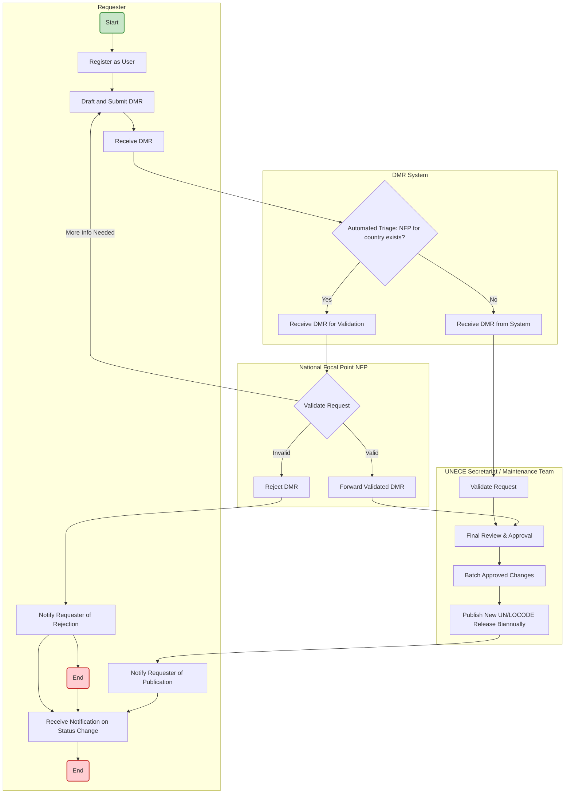

# Testing
This is a testbed/scratchbed/Sandpit nothing serious here at all repository to explore features and ways of using GitHub

## And another thing
Just playing with markdown. There is no need at all for the list I'm about to introduce:
1. Item 1
2. Item 2
3. Item 3

No need at *all*.




## Aus Government DIVC consultations

```mermaid
flowchart TD
    %% Styling
    classDef consult fill:#e1f5fe,stroke:#0288d1,stroke-width:2px;
    classDef action fill:#f1f8e9,stroke:#558b2f,stroke-width:2px;
    classDef joint fill:#fff3e0,stroke:#ef6c00,stroke-width:2px;

    %% State Initiatives
    subgraph State [State Government Initiatives]
        S1[2020: QLD Fraser Coast Trial <br><i>Targeted Venue Consultation</i>]:::consult
        S2[2021-22: NSW Digital ID & VC <br><b>[PUBLIC CONSULTATION]</b>]:::consult
        S3[2022-23: QLD Townsville Trial <br><i>Industry Stakeholder Consultation</i>]:::consult
        S4[Nov 2023: QLD Statewide mDL Rollout]:::action
        S5[Dec 2025: WA 'Strong' Biometric ID Enablement]:::action
    end

    %% National Harmonisation (Austroads)
    subgraph Austroads [Austroads mDL Harmonisation]
        A1[2022-23: mDL National Standards <br><b>[INDUSTRY CONSULTATION]</b>]:::consult
        A2[Nov 2023: National mDL Framework Released]:::action
    end

    %% Federal Initiatives
    subgraph Federal [Federal Consultations - AGDIS & Policy]
        F1[Sep-Oct 2023: Digital ID Bill <br><b>[PUBLIC CONSULTATION]</b>]:::consult
        F2[Jul-Aug 2024: AGDIS Biometrics <br><b>[TECHNICAL CONSULTATION]</b>]:::consult
        F3[Nov 2024: Digital ID Act 2024 Commences]:::action
        F4[Dec 2025: AGDIS Wallet Expansion <br><b>[MARKET RFI CONSULTATION]</b>]:::consult
        F5[May-Jul 2026: VC Trust Framework <br><b>[CURRENT PUBLIC CONSULTATION]</b>]:::consult
    end

    %% Joint Coordination
    subgraph Joint [Joint Federal-State Coordination]
        J1[Jun 2024: DDMM Endorses National ID & VC Strategy]:::joint
        J2[Feb 2026: Updated National Strategy on Interoperability]:::joint
    end

    %% Relationships & Flow with explanatory labels
    S1 -->|Informed scale-up & local feedback| S3
    S3 -->|Validated tech stack with hospitality/police| S4
    
    A1 -->|Consolidated vendor & registry feedback| A2
    A2 -->|Enforced ISO 18013-5 alignment| S4
    A2 -->|Provided technical blueprint to Ministers| J1
    
    S2 -->|Contributed decentralised architecture insights| J1
    
    F1 -->|Defined legislative scope & privacy protections| F2
    F2 -->|Set testing standards for biometric solutions| F3
    F3 -->|Legally established AGDIS framework| J1
    
    J1 -->|Mandated user-wallet ecosystem trials| F4
    S4 -->|Demonstrated mDL maturity to other states| S5
    
    S5 -->|Expanded biometric identity tier validation| J2
    F4 -->|Proven market readiness for VCs| J2
    J2 -->|Drafted unified rules for current framework| F5

    class S1,S2,S3,A1,F1,F2,F4,F5 consult;
    class S4,S5,A2,F3 action;
    class J1,J2 joint;
    ```
